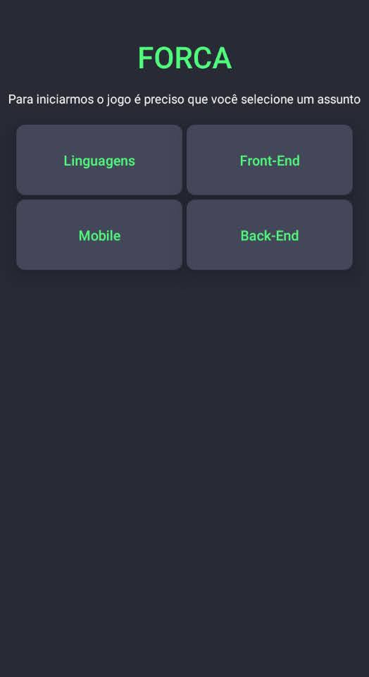
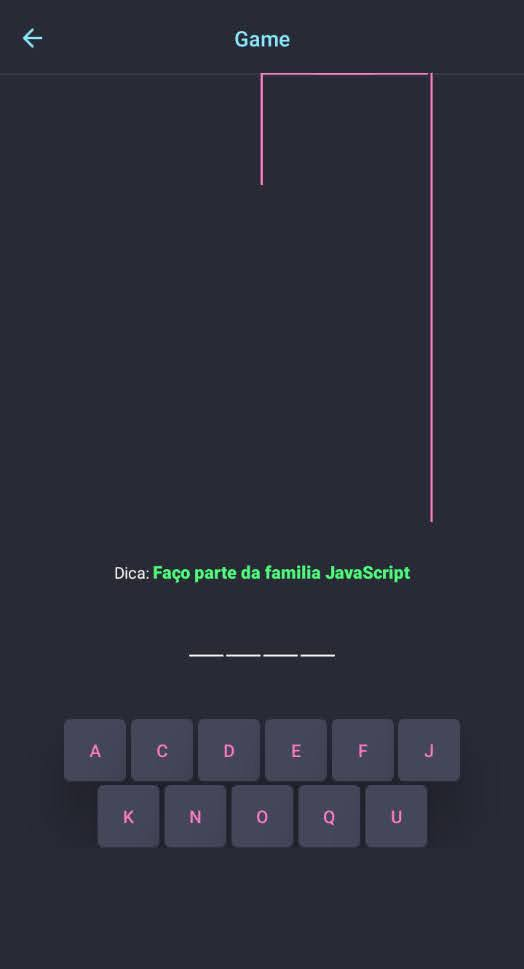
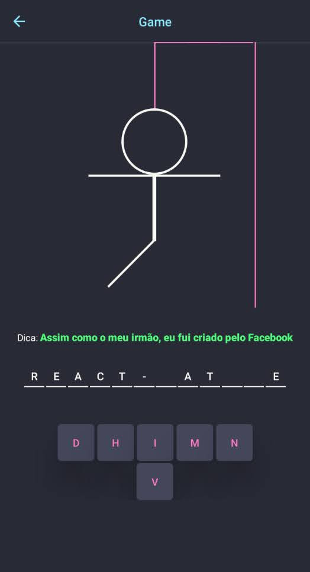

# Jogo da Forca

## Resumo
O Famoso jogo da Forca, Uma rapida diversão. Onde o objetivo é divulgar o meu primeiro prejeto pessoal de <em>REACT NATIVE</em>

 

## Explicação

  
  
  

 

O Projeto **Jogo da Forca**, foi criado com o objetivo de por em pratica os meus primeiros conhecimentos usando <em>REACT NATIVE</em>, e algumas dependências extras, além da nova experiência de programar em um framework MOBILE.

A Estrutura é simples, e dividida em duas *SCREENS*:
- `Home`: O usuario vai ter acesso a uma pequena lista de assuntos que poderá escolher por sua vontade. E ao selecionar, o mesmo sera direcionado para a *SCREEN* "Game", uma palavra sera sorteada para o inicio do jogo.
- `Game`: Aqui o seu objetivo é acertar a palavra que esta escondida.

 

Sobre o jogo, ele vai funcionar da seguinte forma:
- **Inicion**: A o entrar na *SCREEN* `Game`. Uma palvra sera sorteada dependendo do assunto escolhido na `Home`. Após selecionada, a palavra sera dividida e mais `7` letras, aleatórias, serão inseridas juntas.
- **Dinamica**: Ao clicar em uma letra, sera avaliado se ela existe na palavra `chave`. Caso a letra exista será mostrado na tela, caso contrario uma parte do boneco sera desenhado na tela. E ao final, o `button` da letra sera removido.
- **Derrota**: Se atingir um total de `5` erros
- **Vitória**: Se conseguir inserir todas as letras, em menos de `5` erros

 

***OBS***: Ao final de tudo, o usuario receberar um alerta, do resultado final e sera redirecionaod para `Home`.

 

## Tecnologias e Ferramentas
- React Native
- TypeScript
- Jest
- Expo Go
- React Navigation
